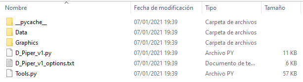
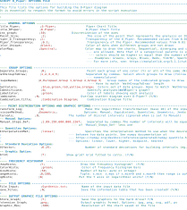

# D-Piper - A modified Piper diagram

## Overview
D-Piper is a free source code developed in Python 3.7 that allows to represent large hydrochemical data sets throughout point density diagrams. Multiple methods of data distribution can be chosen for data visualization.

## Paper
If you use the program in one of your studies, please cite this paper:
* Moreno Merino, L.; Aguilera, H.; González Jiménez, M.; Díaz Losada, E. 2021 D-Piper, a modified Piper
diagram to represent big sets of hydrochemical analyses. Environmental Modelling and Software, 138.

    https://doi.org/10.1016/j.envsoft.2021.104979

## How to install

The program could be easily **installed** by:

* **Download** and unzip the repositoy [*zip file*](https://github.com/chesstor/D-Piper/archive/refs/heads/main.zip) in your working directory.

or
* **Cloning** the repository using git*:
    `git clone https://github.com/chesstor/D-Piper.git`

D-Piper have been programmed using **Python `3.7`**, and depends mainly on common Python [packages](##Dependecies).

For installing, running and managing Python packages, we recommend using [Anaconda](https://docs.anaconda.com/free/anaconda/install/windows/) or [Miniconda](https://docs.conda.io/en/latest/miniconda.html#windows-installers) distribution. The latter is a lighter release of Anaconda. 

For avoiding conflicts among the dependencies and Python versions while running D-Piper, it's recommended to create a **new conda environment** with the same Python and packages versions in which it was programmed. You can do this:

* **Option 1**. [*Manually*](https://conda.io/projects/conda/en/latest/user-guide/tasks/manage-environments.html#creating-an-environment-with-commands) from the Anaconda Prompt by running:

    `conda create --name dpiper python=3.7 numpy=1.17.4 pandas=1.1.3 matplotlib=3.2.2 jenkspy=0.2.0
`

or
* **Option 2**. From an [*yml file*](https://conda.io/projects/conda/en/latest/user-guide/tasks/manage-environments.html#creating-an-environment-from-an-environment-yml-file) using the *DPiper.yml* file included in the repository. This option will create an environment with all the packages and its versions included in the file. The first line of the *yml* file sets the new environment's name. Be free to change it for other env name.  Simply run the following on the Anaconda Prompt.:

    `conda env create -f DPiper.yml`

The program has been programmed and tested in a **Windowsx64** machine. The performance in a Linux/Unix platform is not granted.

## Dependecies:
The program relies on Python standard libraries. The library ´jenkspy` is used when choosing Jenk's division method.

_ `Numpy 1.17.4`

_ `Pandas 1.1.3`

_ `Matplotlib 3.2.2`

_ `Jenkspy 0.2.0`

## How does it work?
To make a D-Piper diagram just follow these steps:
### 1. Prepare the file structure:
Keep the file structure as shown in the figure:

 * The input analytical data files must be saved in the *Data* folder. The sample files used in the article to make Figures 2, 3, 4 and 5 can be found in this folder.
 * The D-Piper diagrams will be saved in the *Graphics* folder. It currently contains some example images.
 * The file *D_Piper_v1_options.txt* contains the necessary instructions and explanations to build the desired D-Piper diagram.
 * The file *D_Piper_v1.py* is the script that you have to run in Python to build a D-Piper diagram. The script is widely commented.
 * The *Tools.py* file is an auxiliary Python code that act as a module and contains all the functions with which the *D_Piper_v1.py* file operates.
 
Do not delete or change any of the above files or folders. If necessary, you can add other folders or files. Note that automatically a *pycache* folder is created, requiered for an optimal execution of the program.
 
The script always reads the drawing options from the *D_Piper_v1_options.txt* file. If you want to save a set of options, you must do so by renaming the file or saving it to another location. For further use, you will have to name it as the original one (*D_Piper_v1_options.txt*) or update the new name in line 65 of the *D_Piper_v1.py* file.

### 2. Preparing the data file:

The data file must be in ASCII format and saved in the *Data* folder.
The data file can have any name.
The structure of the data file should be as follows:

* TAB-separated ASCII file
* It must contain ten columns:
      

*Identifier*: sample identification number. 
*Group*: Each sample can belong to a different group. Up to nine groups can be differentiated. Although no error will be shown, setting more groups will create overlap problems. 
*Eight columns with analytical results*. The ion content should be expressed in mg/L (milligrams per liter) or ppm (parts per million). 

### 3. Preparing the _Options_ file:

The *D_Piper_v1_options.txt* file must be in ASCII format, separated by semicolon (;)
It is a self-explanatory file that shows all the options of the program.
It is essential to comply with the file format to avoid execution errors.

The contents of this file are explained at the end of this document. Options that can be modified are shown in red, explanatory text and guidelines are shown in blue, and variable names in black.

### 4. Run the program:
The program simply works by running the *D_Piper_v1.py* script.
This can be ahieved from the Anaconda prompt (with the correct env activated and python-path active) or from any development platform (Spyder, PYCharm...).

The execution from the **Anaconda Prompt** shell (or other shell) could be done by simply running:

`>>> python D_Piper_v1.py`

## Get in Touch

* Questions or comments can be asked and answered on [Github Discussions](https://github.com/chesstor/D-Piper/discussions).
* Bugs, requests, installation problems and other improvements can be posted as [Github Issues](https://github.com/chesstor/D-Piper/issues).

## Authors
All authors belong to IGME Geological Survey of Spain. C/Ríos Rosas 23, 28003 Madrid, Spain

* M. González-Jiménez         miguigonn@gmail.com

* L. Moreno Merino            l.moreno@igme.es

* H. Aguilera Alonso          h.aguilera@igme.es

* E. Díaz Losada              elisabeth.diaz@igme.es

## Copyright
License: GPLv3 
